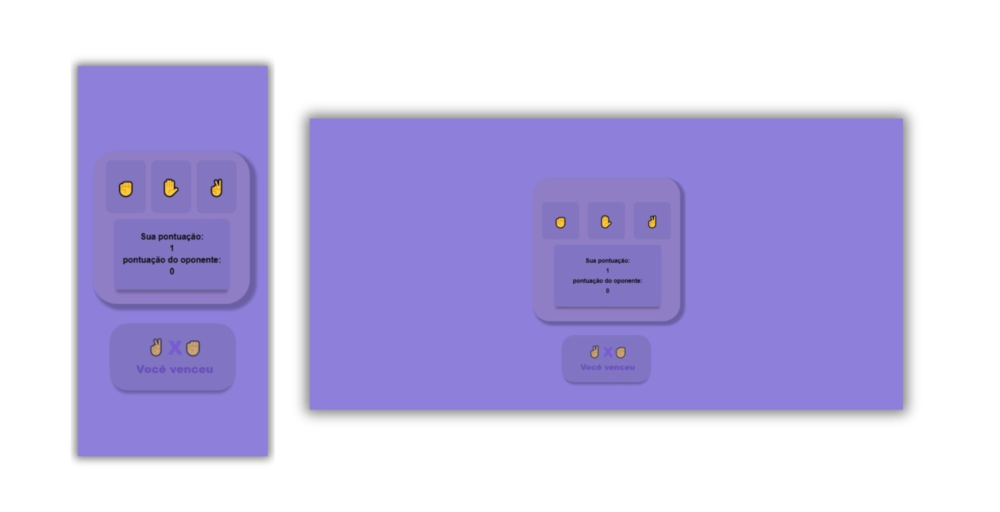

## Jokenpô

## 📖 What is it?
This project is a digital recreation of the classic game Rock-Paper-Scissors (Jokenpô), built using core web technologies: HTML,
CSS, and JavaScript. With an intuitive and dynamic interface, it provides a fun and interactive experience for users.

## ✨ Features
Dynamic Gameplay: Choose between rock, paper, or scissors and challenge the game logic.
Score System: Real-time score updates to track who’s winning.
Responsive Design: Adaptable interface for desktops, tablets, and smartphones, ensuring a seamless experience on any device.
Instant Visual Feedback: Clear results displayed after each round, highlighting the winner.
Modern and Minimalist Style: Clean visuals designed with CSS for focused gameplay and clarity. 

## 🎮 How to Play
 - Select your move (Rock, Paper, or Scissors).
 - Instantly see the result on the screen.
 - The score is automatically updated after each round.

## 🛠️ Technologies Used

## 📂 Project Link
https://jokenpogamedev.netlify.app/
